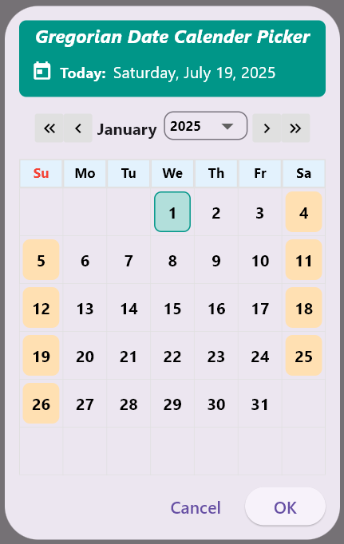
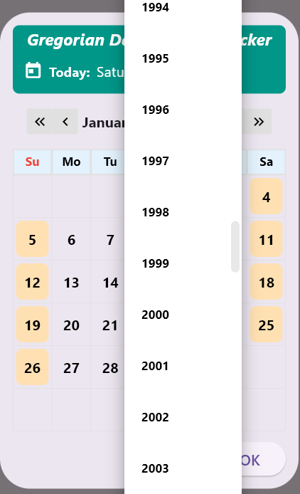
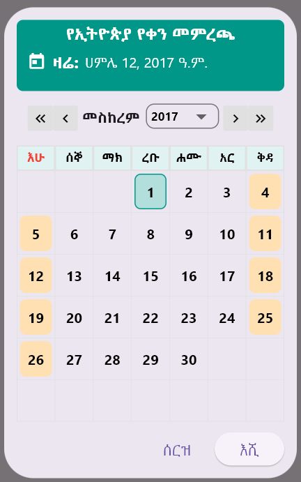
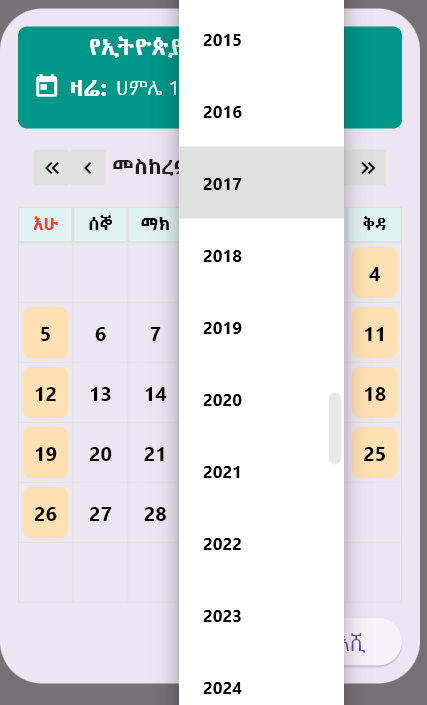
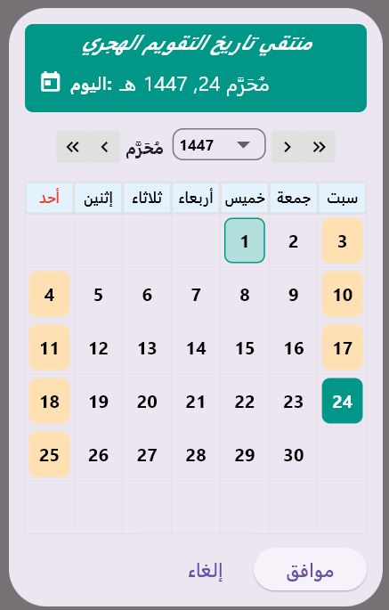
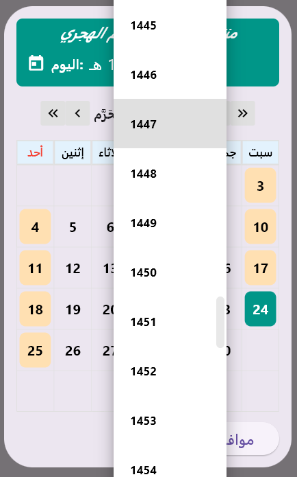

# Calendar Picker
A lightweight, customizable date picker package for Flutter that supports:

- 🗓️ **Gregorian Calendar**
- 🌙 **Hijri (Islamic) Calendar**
- 🗿 **Ethiopian Calendar**

Choose any calendar with a **unified API** using a beautiful, fully custom dialog.

---
---

## ✨ Features

- 📅 Fully custom-built UI — no external dependencies
- 🔁 Month and year navigation with dropdowns and arrow buttons
- ✅ Highlights today's date and the selected date
- 📆 Configurable year range and intial year in the dropdown (`firstYear`, `lastYear` and `initialYear`)
- 🎯 Unified method: `showUnifiedDatePicker(...)`
- 🌍 Extensible and clean codebase
---

## 📸 Screenshots

### 📅 Gregorian Calendar

| Table View | Year Dropdown |
|------------|----------------|
|  |  |

### 📅 Ethiopian Calendar

| Table View | Year Dropdown |
|------------|----------------|
|  |  |

### 📅 Hijri Calendar

| Table View | Year Dropdown |
|------------|----------------|
|  |  |

---

## 🚀 Getting Started

📁 Folder Structure
       src/ 
          gregorian_date_picker.dart 
          hijri_date_picker.dart 
          eth_date_picker.dart 
          unified_picker.dart ✅ main method exported 
          date_converter.dart for conversions (Ethiopian/Hijri)

### 📦 Installation

Add this package to your `pubspec.yaml`:

```yaml
dependencies:
  calendar_picker:
    git:
      url: https://github.com/HalidAwell/calendar_picker.git


## 🚀 Usage

```dart
import 'package:calendar_picker/calendar_picker.dart';

final pickedDate = await showUnifiedDatePicker(
  context: context,
  calendarType: CalendarType.ethiopian, // or hijri/gregorian
  initialYear: 2015,// initial value of dropdown
  firstYear: 2000, //range of year
  lastYear: 2030,
);

## 📬 Contact

For questions, feedback, or contributions:

- 📧 Email: halidawell00@gmail.com
